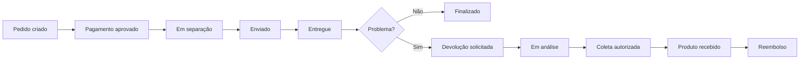

# OpsFlow — Plataforma de Operações e Pedidos

Sistema corporativo para centralizar e acompanhar o ciclo operacional de pedidos de varejo/e-commerce — desde a criação até a entrega ou devolução.

## Contexto

Empresas de varejo recebem muitos pedidos e precisam acompanhar o ciclo operacional após a compra. Hoje, informações sobre pedidos, atrasos, devoluções e ocorrências ficam espalhadas em planilhas, e-mails e sistemas diferentes. O **OpsFlow** centraliza esse processo em uma única plataforma.

## Problema que resolve

- Dificuldade para saber em que etapa está cada pedido.
- Falta de visão sobre pedidos atrasados ou que precisam de ação humana.
- Processo de devolução descentralizado.
- Falta de histórico claro das alterações realizadas.
- Comunicação manual por e-mail em diferentes etapas do processo.

## Usuários

| Perfil | Responsabilidades |
|---|---|
| **Analista de Operações** | Acompanha pedidos, devoluções, atrasos e exceções; executa ações operacionais. |
| **Supervisor / Gestor** | Acompanha indicadores, volume de pedidos, gargalos e performance operacional. |
| **Administrador** | Gerencia usuários, perfis e permissões. |

## Fluxo principal

## Regras de negócio

- Um pedido só pode avançar para determinados status (máquina de estados).
- Toda alteração importante gera histórico/auditoria.
- Uma devolução deve estar vinculada a um pedido e aos itens selecionados.
- Usuários diferentes possuem permissões diferentes (RBAC).
- Algumas ações geram notificações e e-mails.
- Processos demorados são executados via Jobs/Queues.

## Stack

- **Backend:** Laravel / PHP
- **Frontend:** Vue.js + TypeScript
- **Banco de dados:** PostgreSQL
- **Testes:** Pest ou PHPUnit
- **Processamento assíncrono:** Jobs e Queues
- **Infraestrutura:** Docker
- **CI/CD:** a definir

## Estrutura do projeto

> _Em construção._ Esta seção será atualizada conforme o projeto evolui.

## Como executar

> _Em construção._ As instruções de setup local serão adicionadas assim que o ambiente Docker estiver configurado.

## Roadmap

- [ ] Modelagem do banco de dados
- [ ] Autenticação e autorização (RBAC)
- [ ] API REST de pedidos
- [ ] Máquina de estados de pedidos
- [ ] Histórico/auditoria de alterações
- [ ] Módulo de devoluções
- [ ] Dashboard operacional
- [ ] Notificações e e-mails
- [ ] Jobs/Queues para processos assíncronos
- [ ] Testes automatizados
- [ ] Docker e ambiente reproduzível
- [ ] CI/CD

## Licença

Projeto de portfólio — sem licença comercial definida.
